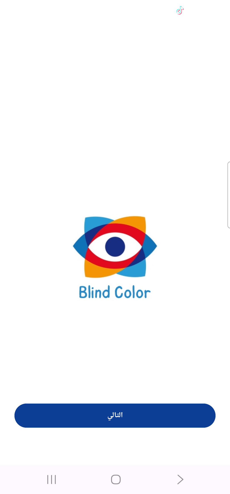
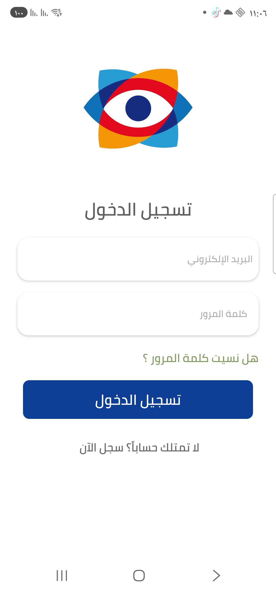
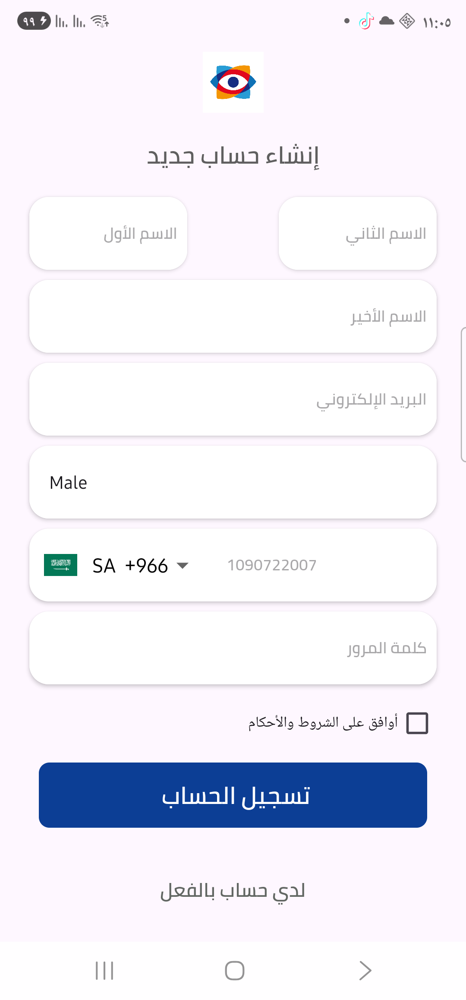
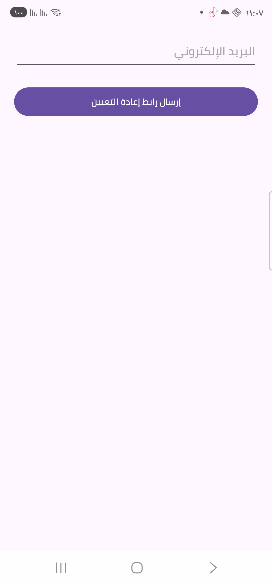
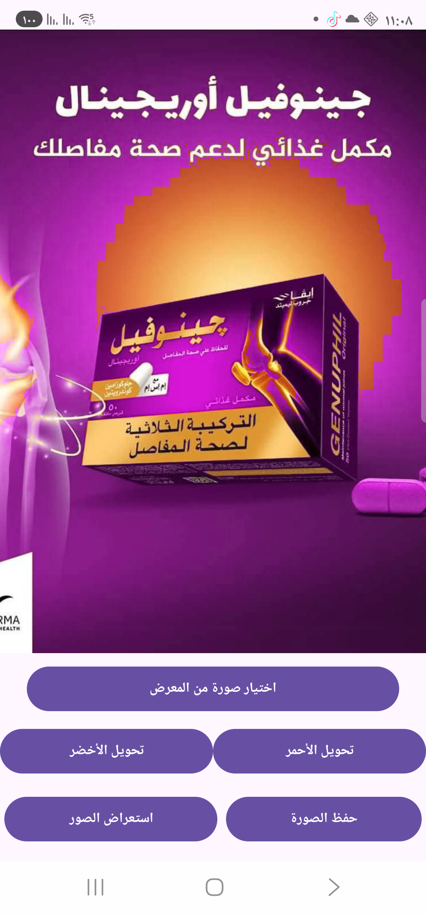
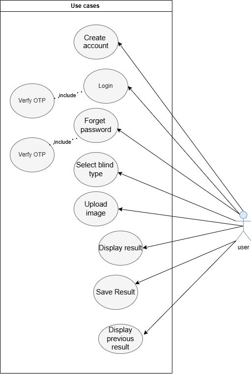

# 👁️ Blind Color

**Graduation Project (CS Senior Project I & II) — Saudi Electronic University**

An Android mobile application that helps people with color vision deficiency (color blindness) perceive images more clearly, by detecting and re-mapping the colors they struggle to distinguish.

> This repository is a **showcase** of the project — screenshots and a description of how it works. The source code is kept private and is not published here.

---

## 📱 About the App

Color blindness (particularly red-green color blindness — protanopia / deuteranopia) affects how a person perceives certain colors in images and everyday life. **Blind Color** lets a user select an image, choose the type of color blindness they experience, and get back a color-adjusted version of that image where the affected colors are shifted into a range they can perceive more easily.

### Core Features

- Secure account creation and login (Firebase Authentication)
- Password recovery via email reset link
- Select color-blindness type
- Upload an image from the gallery
- Convert the image's colors (red/green channel adjustment) to make them more distinguishable
- Save the converted image
- Browse previously converted images

## 🖼️ Screenshots

<table>
<tr>
<td align="center"><b>Splash Screen</b></td>
<td align="center"><b>Login</b></td>
<td align="center"><b>Create Account</b></td>
</tr>
<tr>
<td></td>
<td></td>
<td></td>
</tr>
<tr>
<td align="center"><b>Forgot Password</b></td>
<td align="center"><b>Convert Image</b></td>
<td align="center"></td>
</tr>
<tr>
<td></td>
<td></td>
<td></td>
</tr>
</table>

## ⚙️ How It Works

1. **Authentication** — New users create an account (name, email, phone, password); returning users sign in. All authentication is handled through **Firebase Authentication**, with a "forgot password" flow that emails a reset link.
2. **Choosing an image** — Once signed in, the user picks an image from their device gallery.
3. **Color conversion** — The app analyzes the image's pixels and remaps the colors that are hard for the selected color-blindness type to distinguish (e.g. shifting reds/greens) into a range that is easier to tell apart, producing an adjusted version of the image.
4. **Saving & history** — The converted image can be saved back to the device, and the app keeps a history of previously converted images the user can browse again later.

### Use Case Overview

## 🛠️ Tech Stack

- **Platform:** Android (Java)
- **Backend / Auth:** Firebase Authentication
- **Data:** Firebase Realtime Database & Cloud Firestore
- **Storage:** Firebase Storage (uploaded/converted images)
- **Notifications:** Firebase Cloud Messaging
- **Methodology:** Waterfall (Software Development Life Cycle)

## 👥 Team

Developed as a Senior Project (CS477 / graduation project) at **Saudi Electronic University**, College of Computing and Informatics, under the supervision of **Dr. Shimaa Nagro**.

---

*This is a portfolio/showcase repository — no source code is included.*
